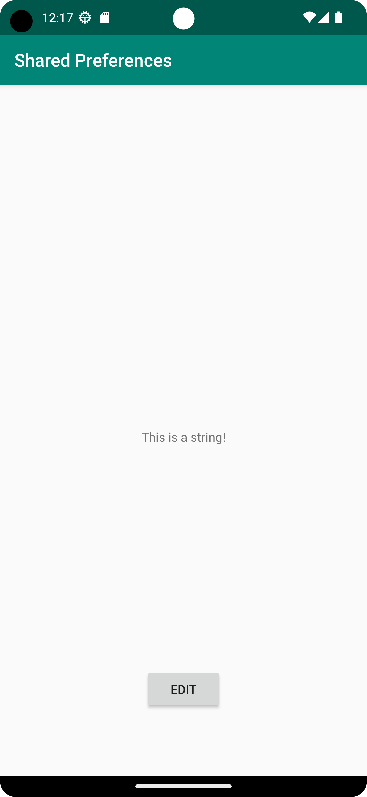

# Rapport

**Skapade ett sharedPreference-objekt och en editor som hanterade strängar där strängarna lagras och visas i huvudaktiviteten**


# Kodsegment 1:
```
    private TextView textView;

    protected void onResume() {
        super.onResume();

        SharedPreferences sharedPreferences = getSharedPreferences("MyPrefs", MODE_PRIVATE);
        String text = sharedPreferences.getString("myText", "");
        textView.setText(text);
    }
```
# Kodsegment 2:
```
        saveButton.setOnClickListener(new View.OnClickListener() {
            @Override
            public void onClick(View v) {
                String text = editText.getText().toString();
                SharedPreferences sharedPreferences = getSharedPreferences("MyPrefs", MODE_PRIVATE);
                SharedPreferences.Editor editor = sharedPreferences.edit();
                editor.putString("myText", text);
                editor.apply();

                Intent intent = new Intent();
                setResult(RESULT_OK, intent);
                finish();
            }
        });
```

